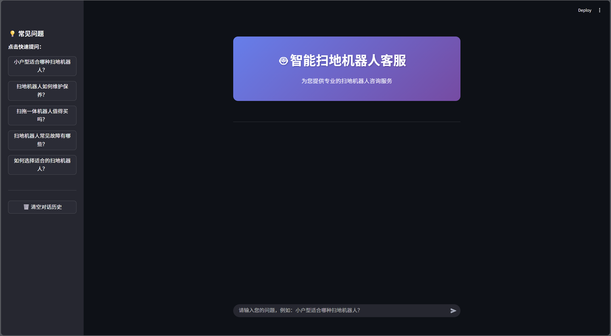
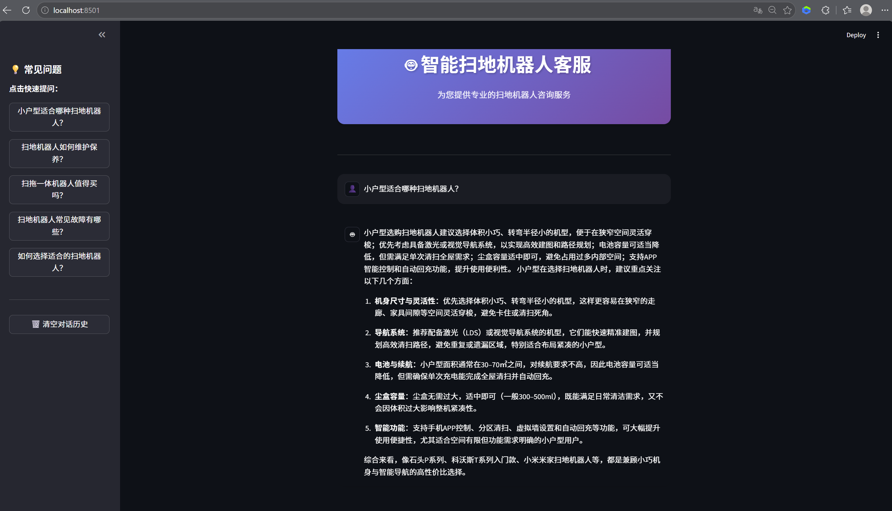

# 🤖 智能扫地机器人客服 Agent

基于 LangChain 和 RAG 技术构建的智能客服系统，专为扫地机器人领域提供专业咨询服务。

## ✨ 功能特性

- **智能问答**：基于 RAG 的知识检索与生成
- **多工具支持**：天气查询、用户信息获取、外部数据 fetch 等
- **流式输出**：实时响应，提升用户体验
- **Streamlit 界面**：友好的可视化交互界面
- **常见问题快捷入口**：一键提问高频问题

## 🚀 快速开始

### 环境要求

- Python 3.10+
- LangChain 1.0+

### 安装依赖
pip install -r requirements.txt
### 启动应用
streamlit run app.py
访问 `http://localhost:8501` 即可使用。
## 🛠️ 技术栈

- **框架**：LangChain 1.0
- **向量数据库**：ChromaDB
- **前端**：Streamlit
- **模型**：通过 `model/factory.py` 统一管理

## 📝 配置说明

所有配置集中在 `config/` 目录：

- `agent.yml`：Agent 行为配置
- `chroma.yml`：向量数据库路径与参数
- `prompts.yml`：系统提示词与管理提示词
- `rag.yml`：RAG 检索与分块配置

## 💡 使用示例

启动应用后，你可以：

1. 直接在输入框提问
2. 点击侧边栏"常见问题"快速咨询
3. 查看完整对话历史
4. 清空历史记录重新开始

## 📄 License

本项目采用 MIT License

